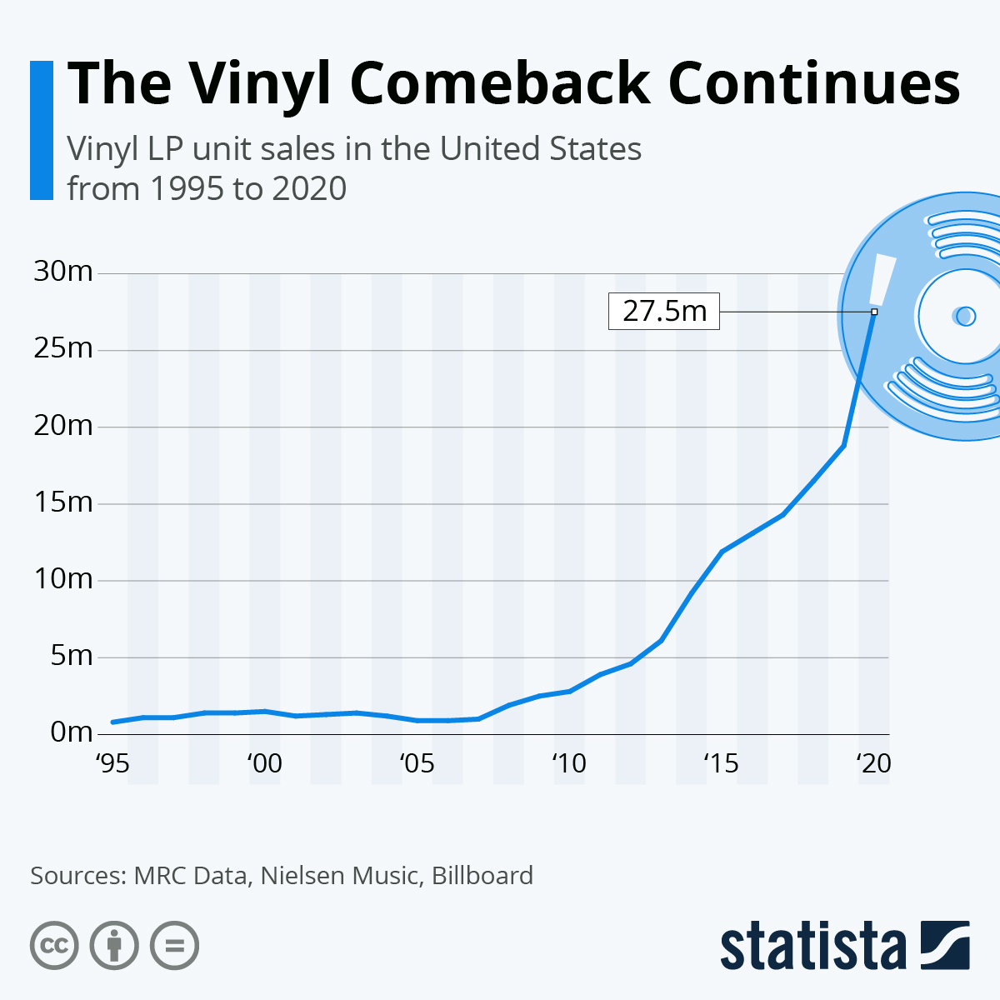
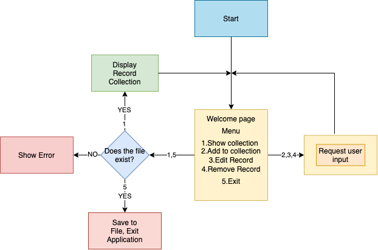
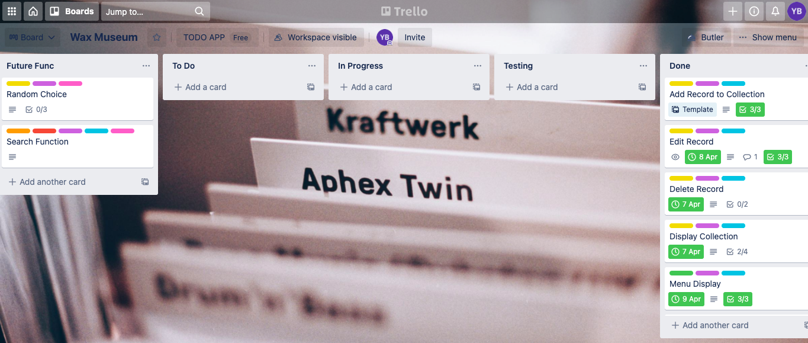

# T1A3 - Terminal Application
<div style="text-align: right"> Yannick Beaucaine </div>

---
<br>

## WaxMuseum
### A record collection archival terminal application

---
<br>

## R4 : Source control repository :
---
<br>

[GitHub](https://github.com/YannickBeaucaine/T1A3-terminal-application)

<br>

## R5 : Statement of purpose :
---

WaxMuseum is a terminal application that allows a user to archive a collection of records by taking users input. The user is prompt with questions such as "Artist Name" and "Album Name" and their input will be locally stored in a file and display an enumerated list. The target audience of WaxMuseum is a constantly growing community of record collector who like to keep track of their current collection.
The purpose of this application is to simplify the way the user interacts with the computer to input their record data. By having questions prompted on screen this will reduce the ammount of time spend using mouse input and reducing error margin by automatically populating data on a spreadsheet. According to Statista.com, Vinyl sales have reached 27.5 million in the United States alone, which leads to a great oppourtunity for this application. To use WaxMuseum, the user will download the source from GitHub.com, and install the correct bundle of gems as instructed. Then, from the terminal and from the root folder they will be able to run the application. A Bash script is provided to automatically install required gems and run the program directly.



<br>

## R6 : MVP Features :
---

- ### Selectable Menu : 
 A simple UI that allows the user
 to navigate through different functions of the terminal application.

 - ### Add,Edit Remove :
 Flexible record collection editing functions.
 The ability to Add a record to your collection in the simplest way possible makes it easy to keep track. The editing function will override previous data and removing the record will update the save file.

 - ### Persistent Storage :
The Application makes use of persistent storage.
Uers input is saved to a .CSV file. The file can also be editied externally 
and loaded trough the App. This allows for the user to save and store their Record collection permanantely 

## Upcoming Updates

- ### Increased Record Information:
Abilty to add additional data for the record such as Genre, Gustom record number,
Physical codition of the record and other...

- ### Advanced Search function :
Ability to search for a record by index number, artist name or genre.

<br>

## R7 : UX Outline:
---

Upon launching, the user will be Welcomed with a logo art and the main menu.
The Menu shows all possible functions from the app. The user will be asked to choose an option by typing the number of one of the options between 1 and 5.
When the option 1 is chosen the entire collection of the user will be displayed indexed. With option 2 the user can add a record to their collection, The user will be prompted with questions about the record that will be entered and saved.
Option 3 allow the user to edit a previous entry by entering the index number of the record, the nsame questions as option 2 will be prompted again and the new entries will override previous input. Option 4 will delete an existing record from the collection by entering the records index number. Option 5 will exit the application and store data to CSV file.

- ### Error Handling : 

In the case that user enters a non existing Menu number, the application will display a description of the Error such as "Enter options between 1 to 5 "

If the user chooses a record index number that does not exist yet the application will show an Error message : "incorrect record number"

If the a the .CSV file containing the Record Collection data, cannot be found, is corrupt or the name file doesn't match. The application will display :
"File does not exists.Please check if the file is present and the name is correct"
<br>

## R8 : WaxMuseum App Control flow chart:
---



<br>

## R9 : Project Management :
---

[Trello](https://trello.com/b/kuzF9IeH/wax-museum)


## R10 : Instructions :
---

### How to install WaxMuseum :

- Clone repo from [GitHub](https://github.com/YannickBeaucaine/T1A3-terminal-application)
- From the command line, in the folder directory, type:
```
./run_app.sh
```
The necessary gems will be installed and the app will open

### Requirements :
- Processor Intel 64-bit core 2 Duo or better.
- Memory 4 Gb RAM or more
- [Ruby](https://www.ruby-lang.org/en/news/2020/10/02/ruby-2-7-2-released/) 2.7.2
- MacOS or Linux
<br>

## R3 : Reference Attribution:
---

R5 : https://www.statista.com/chart/7699/lp-sales-in-the-united-states/